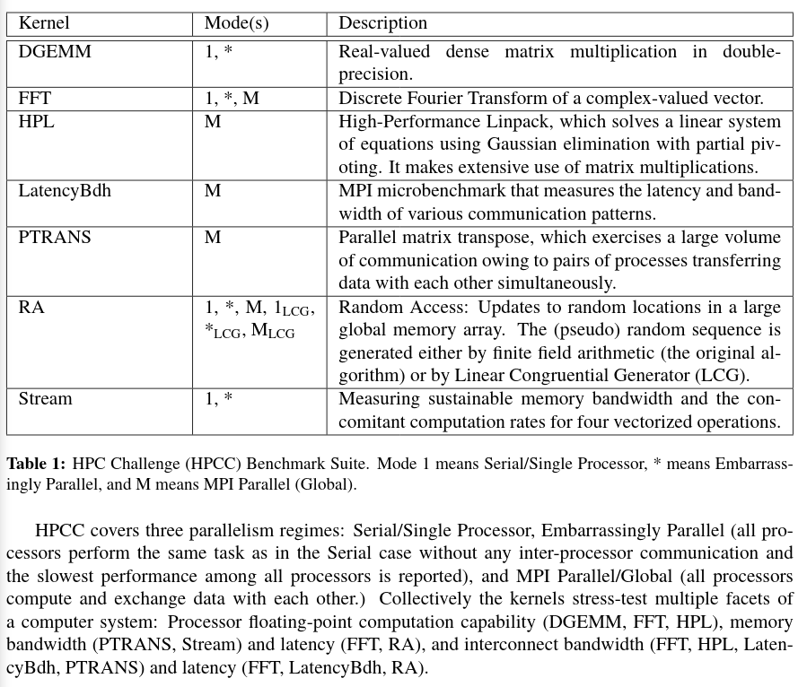

# A simple Installation guidance for HPCC (HPC Challange Benchmark)

### Related Website:

* [icl.utk: Official Website](https://icl.utk.edu/hpcc/)
* [icl.utk: Download](https://icl.utk.edu/hpcc/software/index.html)
* [ScienceDirect: HPC Benchmark Assessment with Statistical Analysis](https://www.sciencedirect.com/science/article/pii/S1877050914001963)

### Installation Environment:

    Ubuntu 18.04.2 LTS, 4.18.0-15-generic, x86_64, VirtualBox, 2GB Memory, HPCC 1.5.0

### 0. Install dependency

    sudo apt-get install -y libatlas-base-dev mpich libmpich-dev gfortran

### 1. Download HPCC

* Download HPCC package from this website [icl.utk: Download](https://icl.utk.edu/hpcc/software/index.html)

### 2. Generate HPCC template configuration file

```bash
# Working Dir: hpcc-1.5.0/hpl/setup
sh make_generic
cp Make.UNKNOWN ../Make.linux
# These Files will be Generated:
	# hpcc-1.5.0/hpl/Make.linux		# Compilation Configuration File
```

### 3. Modify `Make.linux` according to the text below

    ARCH         = linux
    MPinc        = /usr/include/mpich/                      # dpkg --listfiles libmpich-dev | grep 'mpi\.h'
    MPlib        = /usr/lib/x86_64-linux-gnu/libmpich.so    # dpkg --listfiles libmpich-dev | grep 'libmpich.so'
    LAinc        = /usr/include/x86_64-linux-gnu/atlas      # dpkg --listfiles libatlas-base-dev | grep 'atlas_buildinfo\.h'

### 4. Compile HPCC

```bash
# Working Dir: hpcc-1.5.0/
make arch=linux -j $(nproc)
# These Files will be Generated:
	# hpcc-1.5.0/hpcc		# Executable File
```

### 5. Execute HPCC

##### Fix `cannot open file hpccinf.txt` bug

```bash
# Working Dir: hpcc-1.5.0/
ln -s _hpccinf.txt hpccinf.txt
```

##### Execute HPCC program

```bash
# Working Dir: hpcc-1.5.0/
mpiexec -n 4 ./xhpl
# These Files will be Generated:
	# hpcc-1.5.0/hpccoutf.txt		# Output File
```

### 6. Understand HPCC Output



```bash
grep -E "HPL_Tflops|PTRANS_GBs|DGEMM_Gflops|FFT_Gflops|RandomAccess.*_GUPs|.+STREAM_|Latency_usec|Bandwidth_GBytes" hpccoutf.txt


[icl.cs: Rules](https://icl.utk.edu/hpcc/overview/index.html)
[icl.cs: Results](http://icl.cs.utk.edu/hpcc/hpcc_results.cgi)
# Output:
# Single = Single CPU
# Star = Embarrassingly Parallel
# MPI = MPI on Whole System
# GUPs = Giga Updates per Second
# Units of STREAM: Giga Bytes per Second


HPL_Tflops=0.0302422

StarDGEMM_Gflops=8.45881
SingleDGEMM_Gflops=8.05084

PTRANS_GBs=1.67951

MPIRandomAccess_LCG_GUPs=0.00473054
MPIRandomAccess_GUPs=0.00467709
StarRandomAccess_LCG_GUPs=0.0297917
SingleRandomAccess_LCG_GUPs=0.0440443
StarRandomAccess_GUPs=0.0242767
SingleRandomAccess_GUPs=0.0412854

StarSTREAM_Copy=4.01934
StarSTREAM_Scale=4.20897
StarSTREAM_Add=4.90132
StarSTREAM_Triad=4.8447
SingleSTREAM_Copy=4.3287
SingleSTREAM_Scale=5.11276
SingleSTREAM_Add=7.40757
SingleSTREAM_Triad=7.1381

StarFFT_Gflops=0.754672
SingleFFT_Gflops=0.735146
MPIFFT_Gflops=2.0557

MaxPingPongLatency_usec=0.304646
RandomlyOrderedRingLatency_usec=0.368722
MinPingPongBandwidth_GBytes=12.5017
NaturallyOrderedRingBandwidth_GBytes=3.49198
RandomlyOrderedRingBandwidth_GBytes=3.57651
MinPingPongLatency_usec=0.27374
AvgPingPongLatency_usec=0.289193
MaxPingPongBandwidth_GBytes=14.1341
AvgPingPongBandwidth_GBytes=13.5313
NaturallyOrderedRingLatency_usec=0.373522
```

