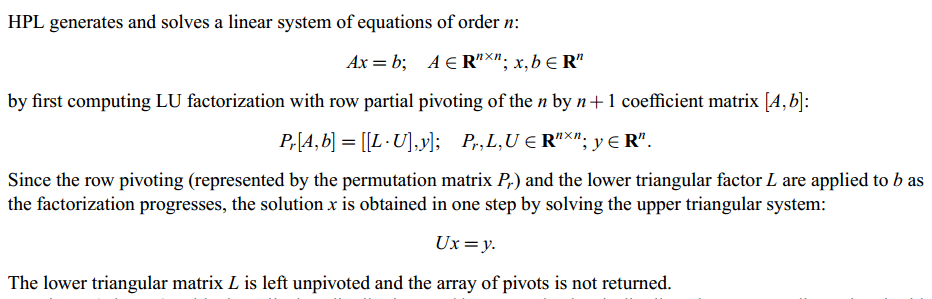
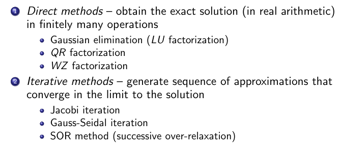
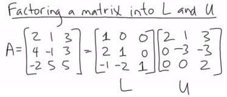
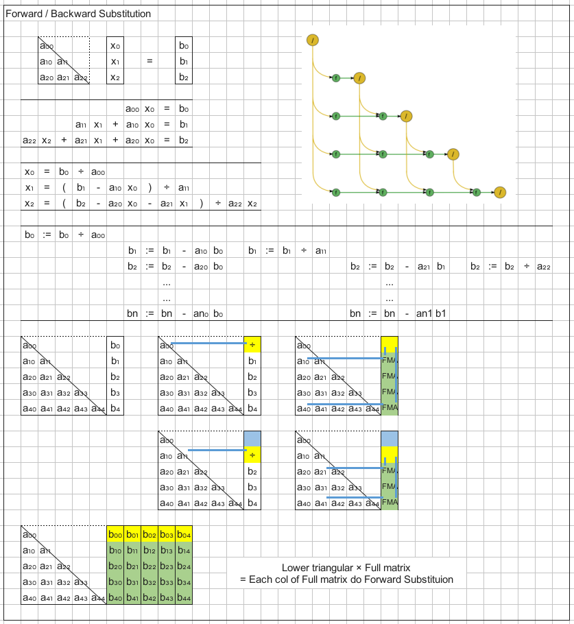
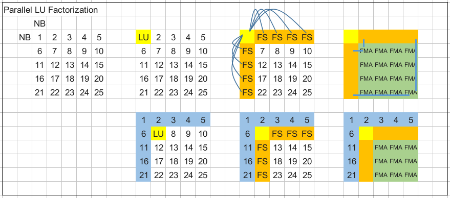
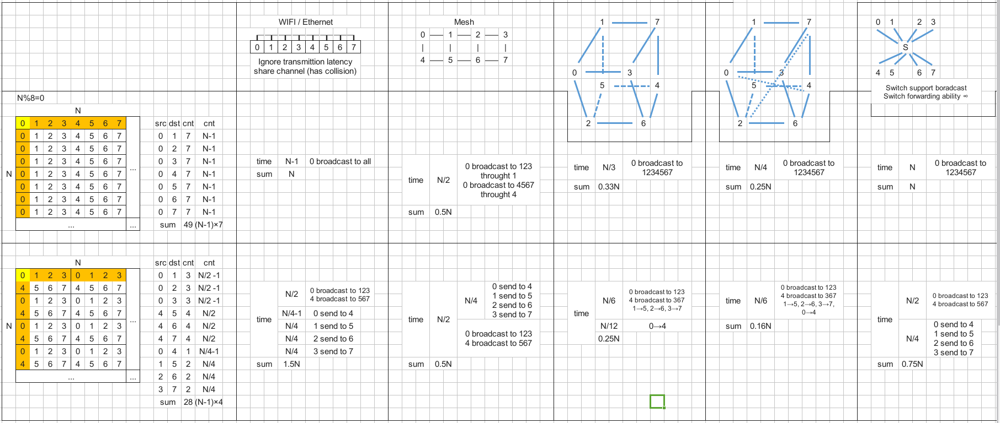

## General




##### methods for solving linear equation system



##### whole process of LU factorization method

$$
A\textbf{x}=\textbf{b}\\\ \\(LU\ factorize)\\L^{T}A=U\\A=LU\\\ \\(forward\ substitution)\\L(U\textbf{x})=\textbf{b}\\L\textbf{y}=\textbf{b}\\\ \\(backward\ substitution)\\U\textbf{x}=y
$$


```bash
Linear System of Equation
	1. LU Factorization
		Guassian Elimination
	2. Forward Substitution
	3. Backward Substition
```

[youtube : Solve a System of Linear Equations Using LU Decomposition](https://www.youtube.com/watch?v=m3EojSAgIao)

[youtube : Understanding LU Factorization](https://www.youtube.com/watch?v=mQyZ3yLk_RY)


## LU Factorization





## Forward / Backward Substitution


> Solving lower triangular system is like solving upper triangular system. The former calculate $x_0, x_1$ to $x_n$; the latter calculate $x_n, x_{n-1}$, to $x_0$. So, the former is forward substitution, the latter is backward substitution.




## Partial Pivoting


## Parallel LU Factorization

[youtube : Parallel LU Factorization](https://www.youtube.com/watch?v=E8aBJsC0bY8)

[pdf : Parallel  Implementations  of  Gaussian  Elimination](https://cs.wmich.edu/elise/courses/cs626/s12/cs6260_presentation_1.pdf)







http://www.netlib.org/benchmark/hpl/algorithm.html

http://cseweb.ucsd.edu/classes/fa98/cse164b/Projects/PastProjects/LU/description.html

https://www.cs.rutgers.edu/~venugopa/parallel_summer2012/ge.html

