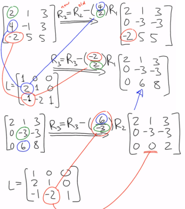
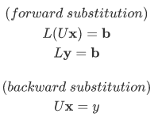
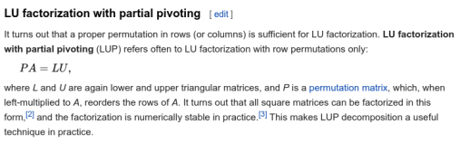
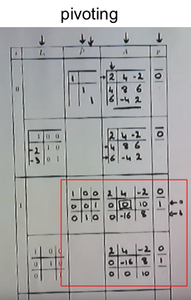
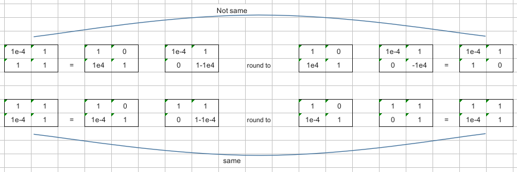
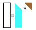
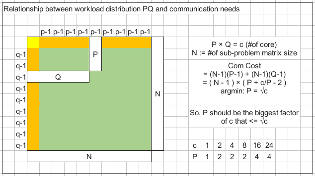

## General


##### methods for solving linear equation system


##### whole process of LU factorization method

$$
A\textbf{x}=\textbf{b}\\\ \\(LU\ factorize)\\L^{T}A=U\\A=LU\\\ \\(forward\ substitution)\\L(U\textbf{x})=\textbf{b}\\L\textbf{y}=\textbf{b}\\\ \\(backward\ substitution)\\U\textbf{x}=y
$$


```bash
Linear System of Equation
	1. LU Factorization
		Guassian Elimination O(2/3 n³) 
	2. Forward Substitution O(n²)
	3. Backward Substition O(n²)
```

[youtube : Solve a System of Linear Equations Using LU Decomposition](https://www.youtube.com/watch?v=m3EojSAgIao)

[youtube : Understanding LU Factorization](https://www.youtube.com/watch?v=mQyZ3yLk_RY)


## LU Factorization (col by col)

[berkeley : LU Factorization # The best! Wonderful! Bravo](https://people.eecs.berkeley.edu/~demmel/cs267_Spr14/Lectures/lecture13_densela_2_jwd14_4pp.pdf)





## Forward / Backward Substitution



> Solving lower triangular system is like solving upper triangular system. The former calculate $x_0, x_1$ to $x_n$; the latter calculate $x_n, x_{n-1}$, to $x_0$. So, the former is forward substitution, the latter is backward substitution.


## Partial Pivoting

[algorithm : gussian elimination # how to pivot](https://www.algorithm-archive.org/contents/gaussian_elimination/gaussian_elimination.html)

[why to pivot](https://cs.wmich.edu/elise/courses/cs626/s12/cs6260_presentation_1.pdf)




##### why pivoting: deal with zero



##### why pivoting: avoid numerical instability (limit of computer finite digit float)



Small pivot will create a enormous L term, destroying the original data on the row.  

Large pivot will soft the problem.


## Parallel LU Factorization (blocking method)

[youtube : Parallel LU Factorization](https://www.youtube.com/watch?v=E8aBJsC0bY8)

[pdf : Parallel  Implementations  of  Gaussian  Elimination](https://cs.wmich.edu/elise/courses/cs626/s12/cs6260_presentation_1.pdf)


In practice, ②'' will be merged into ①. When calculating the U₀₀ in Gaussian Elimination, we can also calculate the L₁₀ part (Gaussian update the whole col, so it can also be done on a tall matrix).



And in practice, ②' can be rewrited as $L₀₀^{-1}A₁₀$, since Level 3 BLAS provide native functions trsm to solve triangular problem.


In fact, ①②'' can be further recursived.


The actual process ↑ 

> d stand for double

Do Panel Factorization (①②''), including pivoting first, and broadcast pivoting info later. 

> idamax (pivot: find max), dswap (pivot: swap row), dscal (GE, col ÷ pivot), dgemm (GE, matrix FMA)

Then, do ②', broadcast A₁₀

> dtrsm (solving triangular matrix with multiple right hand sides)

Finally, broadcast panel and do ③'

> dgemm (matrix FMA), cost 68% time according to vtune.

After LU Factorization, do forward/backward substitution

> dtrsv (solving triangular maxtrix)


## P and Q





http://www.netlib.org/benchmark/hpl/algorithm.html

http://cseweb.ucsd.edu/classes/fa98/cse164b/Projects/PastProjects/LU/description.html

https://www.cs.rutgers.edu/~venugopa/parallel_summer2012/ge.html

https://www.netlib.org/benchmark/hpl/scalability.html